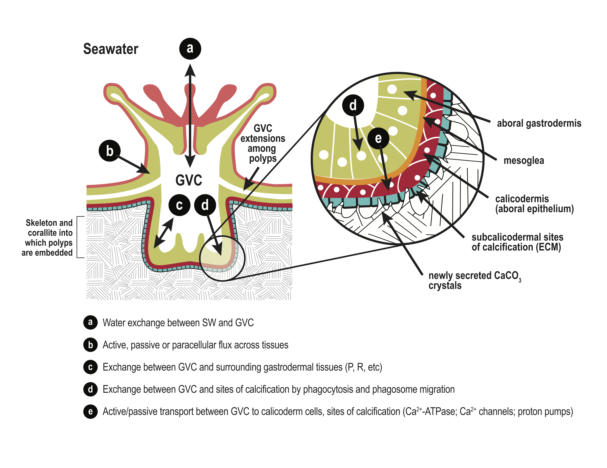

<style>
  h2{color: teal !important}
  h1{color: navy !important}
  body{background-color: gray95 !important}
</style>

```{r setup, include=FALSE}

knitr::opts_chunk$set(echo = FALSE)
options(warn = -1)

```

```{r packages, include=FALSE}

## Packages to load
library(nlme)
library(Rmisc)
library(ggplot2)
library(r2glmm)
library(cowplot)
library(extrafont)
library(plotly)
library(kableExtra)
library(pander)
library(gridExtra)
library(grid)

## run the following two lines if running for the first time since installing 'extrafont'
#font_import()
#fonts() 

```

```{r set formatting and labels, include=FALSE}

## Set some standards

# set labels
MLab <- expression(paste("Calcification (nmol CaCO" [3]~ "hr"^-1,"cm"^-2, ")" ))
DLab <- expression(paste("Calcification (nmol CaCO" [3]~ "hr"^-1,"polyp"^-1, ")" ))

# set plot theme
theme_set(theme_bw())

# set the current date
date <- Sys.Date() 

```

<br/>

#### Colleen B. Bove^1,2^, Robert F. Whitehead^2^, Alina M. Szmant^2^

^1^ Environment, Ecology, and Energy Program, University of North Carolina at Chapel Hill, Chapel Hill, NC, USA

^2^ Center for Marine Science, University of North Carolina Wilmington, Wilmington, NC, USA

<br/>

#### **Abstract:**
Coral polyps have a fluid-filled internal compartment, the gastrovascular cavity (GVC). Respiration and photosynthesis cause large daily excursions in GVC oxygen concentration (O~2~) and pH, but few studies have examined how this correlates with calcification rates. We hypothesized that GVC chemistry can mediate and ameliorate the effects of decreasing seawater pH (pH~SW~) on coral calcification. Microelectrodes were used to monitor O~2~ and pH within the GVC of *Montastraea cavernosa* and *Duncanopsammia axifuga* (pH only) in both the light and the dark, and three pH~SW~ levels (8.2, 7.9, and 7.6). At pH~SW~ 8.2, GVC O~2~ ranged from ca. 0 to over 400% saturation in the dark and light, respectively, with transitions from low to high (and vice versa) within minutes of turning the light on or off. For all three pH~SW~ treatments and both species, pH~GVC~ was always significantly above and below pH~SW~ in the light and dark, respectively. For *M. cavernosa* in the light, pH~GVC~ reached levels of pH 8.4–8.7 with no difference among pH~SW~ treatments tested; in the dark, GVC dropped below pH~SW~ and even below pH 7.0 in some trials at pH~SW~ 7.6. For *D. axifuga* in both the light and the dark, pH~GVC~ decreased linearly as pH~SW~ decreased. Calcification rates were measured in the light concurrent with measurements of GVC O~2~ and pH~GVC~ For both species, calcification rates were similar at pH~SW~ 8.2 and 7.9 but were significantly lower at pH~SW~ 7.6. Thus, for both species, calcification was protected from seawater acidification by intrinsic coral physiology at pH~SW~ 7.9 but not 7.6. Calcification was not correlated with pH~GVC~ for *M. cavernosa* but was for *D. axifuga*. These results highlight the diverse responses of corals to changes in pH~SW~, their varying abilities to control pH~GVC~, and consequently their susceptibility to ocean acidification.

<br/>

##### **Citation:**
Bove, C.B., Whitehead, R.F. & Szmant, A.M. *Responses of coral gastrovascular cavity pH during light and dark incubations to reduced seawater pH suggest species-specific responses to the effects of ocean acidification on calcification*. Coral Reefs 39, 1675–1691 (2020). https://doi.org/10.1007/s00338-020-01995-7

<br/>

## Coral Poly and Design Setup {.tabset}

These figures were created using illustrator and image editing software.

### <span style="color: #0072B2;">**Figure 1**</span>



Simplified diagram of a coral polyp and skeleton morphology, with enlargements of the aboral tissue layers. There are two sets of tissue layers in corals: an oral diploblastic layer in which the epithelial layer does not calcify (dark pink), and an aboral diploblastic tissue layer in which the epithelium calcifies (known as the calicodermis: darker red). The turquoise blue layer represents the extracellular calcifying medium (ECM) in between the calicodermis and skeleton in which CaCO~3~ precipitation takes place. Letters and arrows represent pools and pathways by which ions, gases, and other substances can be transported or exchanged among coral tissues and compartments. **a** Water exchange between ambient seawater and the gastrovascular cavity (GVC) through the polyp mouth. **b** Active, passive, or paracellular flux from seawater across tissue layers into the GVC. **c** Exchange of metabolites from respiration, photosynthesis, and other metabolic processes between GVC and surrounding gastrodermal cells. **d, e** Exchange of ions between GVC, calicodermis, and sites of calcification by phagocytosis, phagosome migration, and active/passive transport mechanisms (Ca~2~^+^-ATPase; Ca~2~^+^ channels; proton pumps).


### <span style="color: #0072B2;">**Figure 2**</span>

<center>
{#id .class width=50% height=50%}
</center>

Photographs of the three study corals under the same lighting conditions and the experimental setup used in this study: **a** *Montastraea cavernosa* colony 1. **b** *M. cavernosa* colony 2. and **c** *Duncanopsammia axifuga*. **d** Photographs of the pH microelectrode inserted through the mouth of *Montastraea cavernosa* and **e** *Duncanopsammia axifuga*. **f** Photograph of the micromanipulator setup used for inserting the microelectrode (identified with the arrows in **d, e** into the coral polyp and the coral’s incubation water bath)


## Light/Dark Experiments {.tabset}

### Analyses

### Figures

### <span style="color: #0072B2;">**Figure 3**</span>

```{r MCAV O2 LD plot, fig.align = 'center', fig.width = 5.5, fig.height = 3}

LD_o2 <- read.csv("Data/LD_O2_mcav_20Jun17.csv", header = TRUE)

ggplot()+
  geom_rect(aes(xmin=0.16674,xmax=10.18194,ymin=-Inf, ymax=Inf), fill="lightgrey", alpha=0.4) +
  geom_rect(aes(xmin= 10.18194,xmax=20.28126,ymin=-Inf, ymax=Inf), fill="lightgoldenrod", alpha=0.4) +
  geom_rect(aes(xmin= 20.28126,xmax=30.3801,ymin=-Inf, ymax=Inf), fill="lightgrey", alpha=0.4) +
  geom_rect(aes(xmin= 30.3801,xmax=40.3119,ymin=-Inf, ymax=Inf), fill="lightgoldenrod", alpha=0.4) +
  geom_rect(aes(xmin= 40.3119,xmax=52.1637,ymin=-Inf, ymax=Inf), fill="lightgrey", alpha=0.4) +
  geom_rect(aes(xmin= 52.1637,xmax=55.0011,ymin=-Inf, ymax=Inf), fill="lightgoldenrod", alpha=0.4) +
  annotate("text", x = 47, y = 430, label = "Montastraea cavernosa", fontface = "italic", size = 2.8) +
  theme(panel.grid.major=element_blank(), panel.grid.minor=element_blank(), panel.background=element_blank(),strip.text=element_text(face="italic"), axis.line=element_line(color="black"), legend.key=element_blank(), text=element_text(family="Times New Roman"))+
  coord_cartesian(xlim = c(0.05, 55), ylim = c(0,450), expand = FALSE) +
  #ylim(0,450) +
  ylab(expression(paste("GVC O"[2] ~ "saturation (%)"))) +
  xlab("Time (min)") +
  geom_line(data = LD_o2, aes(time.min., o2sat), size=1) +
  ggsave("Figures/Fig3_LD_O2.pdf", height = 3, width = 5.5, useDingbats = FALSE)

```
*Montastraea cavernosa*: representative example of the change in GVC O~2~ saturation as measured by an oxygen microelectrode in response to changes in light level (0 vs 300–400 $\mu$E m^-2^ s^-1^) at 8.2 pH~SW~ (control). GVC O~2~ decreased in the dark to near 0% saturation and then increased to ca. 400% saturation. Gray background represents times in the dark, while yellow background denotes the lights being on. Horizontal dashed line is the measured incubation seawater % O~2~ saturation

<br/>


### <span style="color: #0072B2;">**Figure 4**</span>

```{r LD data setup}

## Read in data and make seawater pH a factor
LD_all <- read.csv("Data/LD_pH_all_20Jun17.csv", header = TRUE)
LD_all$fwater <- factor(LD_all$water)
LD_all$fwater<-factor(LD_all$water, levels = c("8.2","7.9","7.6"))

## Subset by species
LD_cav <- subset(LD_all, species == "MCAV")
LD_dun <- subset(LD_all, species == "DAXI")

```

```{r LD pH MCAV plots}

## 8.2 pH plot
LD_mcav_82 <- subset(LD_cav, water == "8.2")

LD_mcav_82_plot <- ggplot() +
  geom_rect(aes(xmin=-Inf,xmax=10,ymin=-Inf, ymax=Inf), fill="lightgoldenrod", alpha=0.4) +
  geom_rect(aes(xmin= 10,xmax=58,ymin=-Inf, ymax=Inf), fill="lightgrey", alpha=0.4) +
  geom_rect(aes(xmin=58,xmax=107,ymin=-Inf, ymax=Inf), fill="lightgoldenrod", alpha=0.4) +
  geom_rect(aes(xmin= 107,xmax=160,ymin=-Inf, ymax=Inf), fill="lightgrey", alpha=0.4) + 
  geom_rect(aes(xmin=160,xmax=Inf,ymin=-Inf, ymax=Inf), fill="lightgoldenrod",alpha=0.4) +
  scale_x_continuous(limits = c(0, 225)) +
  geom_hline(yintercept = 8.2, size=0.5, linetype=2, colour="grey") +
  geom_line(data = LD_mcav_82, aes(x = time, y = gvc), size = 1, colour = "#0072B2") +
  ylab("") +
  xlab("") +
  ggtitle("") +
  theme(panel.grid.major=element_blank(), panel.grid.minor=element_blank(), panel.background=element_blank(),strip.background=element_blank(), strip.text=element_text(face="italic"), axis.line=element_line(color="black"), legend.key=element_blank(), text=element_text(family="Times New Roman")) +
  scale_color_manual(values=c("#0072B2")) +
  ylim(6.5,9)	

## 7.9 pH plot
LD_mcav_79 <- subset(LD_cav, water == "7.9")

LD_mcav_79_plot <- ggplot() +
  geom_rect(aes(xmin=-Inf,xmax=18,ymin=-Inf, ymax=Inf), fill="lightgoldenrod", alpha=0.4) +
  geom_rect(aes(xmin= 18,xmax=85,ymin=-Inf, ymax=Inf), fill="lightgrey", alpha=0.4) +
  geom_rect(aes(xmin=85,xmax=130,ymin=-Inf, ymax=Inf), fill="lightgoldenrod", alpha=0.4) +
  geom_rect(aes(xmin= 130,xmax=177,ymin=-Inf, ymax=Inf), fill="lightgrey", alpha=0.4) +
  geom_rect(aes(xmin=177,xmax=Inf,ymin=-Inf, ymax=Inf), fill="lightgoldenrod",alpha=0.4) +
  scale_x_continuous(limits = c(0, 225)) +
  geom_hline(yintercept = 7.9, size=0.5, linetype=2, colour="grey") +
  geom_line(data = LD_mcav_79, aes(x = time, y = gvc), size = 1, colour = "#009E73") +
  ylab("") +
  xlab("") +
  theme(panel.grid.major=element_blank(), panel.grid.minor=element_blank(), panel.background=element_blank(),strip.background=element_blank(), strip.text=element_text(face="italic"), axis.line=element_line(color="black"), legend.key=element_blank(), text=element_text(family="Times New Roman")) +
  scale_color_manual(values=c("#0072B2")) +
  ylim(6.5,9)


## 7.6 pH plot
LD_mcav_76 <- subset(LD_cav, water == "7.6")

LD_mcav_76_plot <- ggplot() +
  geom_rect(aes(xmin=-Inf,xmax=10,ymin=-Inf, ymax=Inf), fill="lightgoldenrod", alpha=0.4) +
  geom_rect(aes(xmin= 10,xmax=61,ymin=-Inf, ymax=Inf), fill="lightgrey", alpha=0.4) +
  geom_rect(aes(xmin=61,xmax=106,ymin=-Inf, ymax=Inf), fill="lightgoldenrod", alpha=0.4) +
  geom_rect(aes(xmin= 106,xmax=156,ymin=-Inf, ymax=Inf), fill="lightgrey", alpha=0.4) +
  geom_rect(aes(xmin=156,xmax=Inf,ymin=-Inf, ymax=Inf), fill="lightgoldenrod",alpha=0.4) +
  scale_x_continuous(limits = c(0, 225)) +
  geom_hline(yintercept = 7.6, size=0.5, linetype=2, colour="grey") +
  geom_line(data = LD_mcav_76, aes(x = time, y = gvc), size = 1, colour = "#D55E00") +
  xlab("") +
  ylab("") +
  theme(panel.grid.major=element_blank(), panel.grid.minor=element_blank(), panel.background=element_blank(),strip.background=element_blank(), strip.text=element_text(face="italic"), axis.line=element_line(color="black"), legend.key=element_blank(), text=element_text(family="Times New Roman")) +
  scale_color_manual(values=c("#0072B2")) +
  ylim(6.5,9)

```

```{r LD pH DAXI plots}

## 8.2 pH plot
LD_dun_82 <- subset(LD_dun, water == "8.2")

LD_dun_82_plot <- ggplot() +
  geom_rect(aes(xmin=-Inf,xmax=10,ymin=-Inf, ymax=Inf), fill="lightgoldenrod", alpha=0.4) +
  geom_rect(aes(xmin= 10,xmax=33,ymin=-Inf, ymax=Inf), fill="lightgrey", alpha=0.4) + 
  geom_rect(aes(xmin=33,xmax=58,ymin=-Inf, ymax=Inf), fill="lightgoldenrod", alpha=0.4) +
  geom_rect(aes(xmin= 58,xmax=80,ymin=-Inf, ymax=Inf), fill="lightgrey", alpha=0.4) + 
  geom_rect(aes(xmin=80,xmax=Inf,ymin=-Inf, ymax=Inf), fill="lightgoldenrod",alpha=0.4) +
  scale_x_continuous(limits = c(0, 130)) +
  geom_hline(yintercept = 8.2, size=0.5, linetype=2, colour="grey") +
  geom_line(data = LD_dun_82, aes(x = time, y = gvc), size = 1, colour = "#0072B2") +
  ylab("") +
  xlab("") +
  ggtitle("") +
  theme(panel.grid.major=element_blank(), panel.grid.minor=element_blank(), panel.background=element_blank(),strip.background=element_blank(), strip.text=element_text(face="italic"), axis.line=element_line(color="black"), legend.key=element_blank(), text=element_text(family="Times New Roman")) +
  scale_color_manual(values=c("#0072B2")) +
  ylim(6.5,9)	

## 7.9 pH plot
LD_dun_79 <- subset(LD_dun, water == "7.9")

LD_dun_79_plot <- ggplot() +
  geom_rect(aes(xmin=-Inf,xmax=12,ymin=-Inf, ymax=Inf), fill="lightgoldenrod", alpha=0.4) +
  geom_rect(aes(xmin= 12,xmax=42,ymin=-Inf, ymax=Inf), fill="lightgrey", alpha=0.4) +
  geom_rect(aes(xmin=42,xmax=74,ymin=-Inf, ymax=Inf), fill="lightgoldenrod", alpha=0.4) +
  geom_rect(aes(xmin= 74,xmax=103,ymin=-Inf, ymax=Inf), fill="lightgrey", alpha=0.4) +
  geom_rect(aes(xmin=103,xmax=Inf,ymin=-Inf, ymax=Inf), fill="lightgoldenrod",alpha=0.4) +
  scale_x_continuous(limits = c(0, 130)) +
  geom_hline(yintercept = 7.9, size=0.5, linetype=2, colour="grey") +
  geom_line(data = LD_dun_79, aes(x = time, y = gvc), size = 1, colour = "#009E73") +
  ylab("") +
  xlab("") +
  theme(panel.grid.major=element_blank(), panel.grid.minor=element_blank(), panel.background=element_blank(),strip.background=element_blank(), strip.text=element_text(face="italic"), axis.line=element_line(color="black"), legend.key=element_blank(), text=element_text(family="Times New Roman")) +
  scale_color_manual(values=c("#0072B2")) +
  ylim(6.5,9)


## 7.6 pH plot
LD_dun_76 <- subset(LD_dun, water == "7.6")

LD_dun_76_plot <- ggplot() +
  geom_rect(aes(xmin=-Inf,xmax=10,ymin=-Inf, ymax=Inf), fill="lightgoldenrod", alpha=0.4) +
  geom_rect(aes(xmin= 10,xmax=37,ymin=-Inf, ymax=Inf), fill="lightgrey", alpha=0.4) +
  geom_rect(aes(xmin=37,xmax=69,ymin=-Inf, ymax=Inf), fill="lightgoldenrod", alpha=0.4) +
  geom_rect(aes(xmin= 69,xmax=88,ymin=-Inf, ymax=Inf), fill="lightgrey", alpha=0.4) +
  geom_rect(aes(xmin=88,xmax=Inf,ymin=-Inf, ymax=Inf), fill="lightgoldenrod",alpha=0.4) +
  scale_x_continuous(limits = c(0, 130)) +
  geom_hline(yintercept = 7.6, size=0.5, linetype=2, colour="grey") +
  geom_line(data = LD_dun_76, aes(x = time, y = gvc), size = 1, colour = "#D55E00") +
  xlab("") +
  ylab("") +
  theme(panel.grid.major=element_blank(), panel.grid.minor=element_blank(), panel.background=element_blank(),strip.background=element_blank(), strip.text=element_text(face="italic"), axis.line=element_line(color="black"), legend.key=element_blank(), text=element_text(family="Times New Roman")) +
  scale_color_manual(values=c("#0072B2")) +
  ylim(6.5,9)

```

```{r LD pH full plot, fig.align = 'center', fig.width = 6.8, fig.height = 6.5}

## Create column of each species' plots
LD_cav_plot <- plot_grid(LD_mcav_82_plot, LD_mcav_79_plot, LD_mcav_76_plot, ncol = 1)
LD_dun_plot <- plot_grid(LD_dun_82_plot, LD_dun_79_plot, LD_dun_76_plot, ncol = 1)

## Combined species plot into single plot
LD_full_plot <- plot_grid(LD_cav_plot, LD_dun_plot, ncol = 2, rel_widths = c(0.9, 0.58), labels = c("(a)  M. cavernosa", "(b)  D. axifuga"), hjust = -0.07, vjust = 1.3, label_size = 10)

## Create labels for axes 
y_grob <- textGrob("GVC pH", gp = gpar(fontsize = 11), rot = 90)
x_grob <- textGrob("Time (m)", gp = gpar(fontsize = 11))

## Final, combined plot
LD_full_plot_final <- grid.arrange(arrangeGrob(LD_full_plot, left = y_grob, bottom = x_grob))

## Save final plot
ggsave(file = "Figures/Fig4_LD_pH.pdf", LD_full_plot_final, width = 6.8, height = 6.5, useDingbats = FALSE)

```
"Light–dark" experiment: representative example of pH~GVC~ profiles with changes from light (300–400 $\mu$E m^-2^ s^-1^) to dark (0 $\mu$E m^-2^ s^-1^) measurement conditions for **a** *Montastraea cavernosa* and **b** *Duncanopsammia axifuga* at 8.2 pH~SW~ (control: blue, upper panel), 7.9 pH~SW~ (green, middle panel), and 7.6 pH~SW~ (red, lower panel). The horizontal gray dashed lines represent incubation pH~SW~

<br/>


### <span style="color: #0072B2;">**Figure 5**</span>

```{r}

```
"Stepwise" experiment: representative example of pH~GVC~ profiles with sequential stepwise decreases in incubation pH~SW~ from 8.2 (control: blue, first segment), to 7.9 (green, second segment), to 7.6 (red, third segment) for **a** *Montastraea cavernosa* and **b** *Duncanopsammia axifuga*. Experiments were repeated both in the light (upper panel) and dark (lower panel). The gray portion of each line denotes adjustment time in which external pH was transitioning from one pH treatment to another by bubbling with CO~2~ and the horizontal lines represent external pH~SW~ levels

<br/>


### <span style="color: #0072B2;">**Figure 6**</span>

```{r}

```
Summary of the mean (± SD) pH~GVC~ measurements made in the light–dark (denoted by circles) and stepwise (denoted by triangles) experiments for (**a**) two colonies of* M. cavernosa* (plotted as separate circles) and (**b**) one colony of *D. axifuga* at the three experimental pH~SW~ treatments (8.2 = blue; 7.9 = green; 7.6 = red). The dashed lines represent pH~SW~ for each treatment. Open symbols denote pH~GVC~ data collected in the light, and solid symbols represent pH~GVC~ data collected in the dark. Linear regression lines and regression statistics are included for each light treatment

<br/>


## Calcification Trials {.tabset}

```{r calcification df setup}

## Read in the data file containing calcification rate and GVC pH data from calcification experiments
calc <- read.csv("Data/Calc_pH_all_18April20.csv", header = TRUE) 

## Modify parameters 
calc$pH <- factor(calc$pH, levels = c("8.2","7.9","7.6")) # make pH a factor and reorder levels
calc$ftime <- factor(calc$time) # make time column a factor
calc$gvc <- as.numeric(calc$gvc) # make GVC pH a numeric

## Create subsets of data for individual fragments and for different species
cav <- subset(calc, Coral!="dun") # make df of M. cavernosa data only
cav1 <- subset(calc, Coral=="cav1") # make df of M. cavernosa colony 1 only
cav2 <- subset(calc, Coral=="cav2") # make df of M. cavernosa colony 2 only
dun <- subset(calc, Coral=="dun") # make df og D. axifuga only

dun$timeb <- factor(dun$timeb, levels = c("15c","1c", "0c")) # reorder the timeb variables within D. axifuga df

```

```{r calcification kable}

kable(calc[c(1:2, 22:23, 51:52),], booktabs = TRUE, caption = "Coral identifier (cav1 = M. cavernosa 1; cav2 = M. cavernosa 2; dun = D. axifuga), species identifier (M = M. cavernosa; D = D. axifuga), treatment (treat; pH), date of experimental run (Date), grouping identifier per trial (Set), time of run (time; timeb), seawater pH (water), change in seawater total alkalinity (delTA), calcification rate in nmols/area (nmol) and normalized against the control (normrate), and GVC pH (gvc) per trial.") %>% 
  kable_styling(font_size = 12, full_width = FALSE)

```

### *M. cavernosa* O~2~ (Figure 7a-c)

<br/>

#### **Figure 7a:** MCAV calcification rate (nmol CaCO~3~ hr^-1^ cm^-2^) against seawater pH

```{r MCAV1 O2 rate v SW pH, fig.align = 'center', fig.width = 4, fig.height = 3.5}

#### Read in the pH data for MCAV 1
o2 <- read.csv("Data/Calc_O2_mcav_17April20.csv", head = TRUE) 


#### Working with O2 calcification rate in each SW O2

## Linear model 
O2_calcVO2_lm <- lm(rate ~ factor(pH), data = o2)
#anova(O2_calcVO2_lm)
#summary(O2_calcVO2_lm)


## Plot
O2_calc_sum <- summarySE(o2, measurevar = "rate", groupvars = c("pH"), na.rm = TRUE) # calculate mean +/- SD for plotting

O2_calcVpH_plot <- ggplot(data = O2_calc_sum, aes(x = factor(pH), y = rate, colour = factor(pH))) +
  geom_errorbar(aes(x = factor(pH), ymin=rate-sd,ymax= rate+sd, colour = factor(pH)), width=0.14, position=position_dodge(0.3), size=0.9) + 
  xlab("Seawater pH") + 
  ylab(MLab) +
  theme(text=element_text(family="Times New Roman"), legend.position="none", panel.grid.major=element_blank(), panel.grid.minor=element_blank(), panel.background=element_blank(),strip.background=element_blank(), strip.text=element_text(face="italic"), legend.key=element_blank()) +
  scale_color_manual("Treatment",labels=c("7.6 O2","7.9 O2","8.2 O2"),values=c("#D55E00", "#009E73", "#0072B2")) +
  geom_point(position=position_dodge(0.3),size=3.5, shape = 16) +
  annotate(geom = "text", size = 3, x = 0.8, y = 0, label = "italic(P) == 0.93", parse = TRUE) + 
  annotate(geom="text", x = 3.3, y = 420, label="a)", size = 5.5, fontface="bold") +
  ylim(0,425)  
O2_calcVpH_plot

```

```{r MCAV1 O2 rate v SW pH tables}

## Anova and summary tables
pander(summary(O2_calcVO2_lm))
pander(anova(O2_calcVO2_lm))

```

<br/>

#### **Figure 7b:** MCAV calcification rate (nmol CaCO~3~ hr^-1^ cm^-2^) against GVC O~2~ saturation

```{r MCAV1 O2 rate v GVC pH, fig.align = 'center', fig.width = 4, fig.height = 3.5}

## Linear model 
O2_calcVgvc_lm <- lm(rate ~ gvc, data = o2)
#anova(O2_calcVgvc_lm)
#summary(O2_calcVgvc_lm)

## Plot
O2_calcVgvc_plot <- ggplot(data = o2, aes(x = gvc, y = rate, colour = factor(pH), shape = factor(time), group = species)) +
  #geom_smooth(method = "lm", se = FALSE, colour = "darkgrey") +
  xlab(expression(paste("GVC O"[2] ~ "saturation (%)"))) + 
  theme(text=element_text(family="Times New Roman"), axis.title.y = element_blank(), axis.text.y = element_blank(), panel.grid.major=element_blank(), panel.grid.minor=element_blank(), panel.background=element_blank(),strip.background=element_blank(), strip.text=element_text(face="italic"), legend.key=element_blank()) +
  scale_color_manual("Treatment",labels=c("7.6 pH","7.9 pH","8.2 pH"),values=c("#D55E00", "#009E73", "#0072B2")) +
  scale_shape_manual("", labels = c("Control", "1 Hr", "15 Hr"), values = c(0,1,2)) +
  geom_point(size = 2, stroke = 1.2) +
  annotate(geom = "text", size = 3, x = 185, y = 0, label = "italic(P) == 0.08", parse = TRUE) +  
  theme(legend.position=c(0.14, 0.95), legend.text = element_text(size = 8), legend.key.size = unit(0.6, "lines"), legend.background = element_rect(fill=NA)) +
  guides(colour = FALSE, shape = guide_legend(override.aes = list(size = 1.8))) +
  annotate(geom="text", x = 630, y = 420, label="b)", size = 5.5, fontface="bold") +
  xlim(150,650) +
  ylim(0,425)  
O2_calcVgvc_plot

```

```{r MCAV1 O2 rate v GVC pH tables}

## Anova and summary tables
pander(summary(O2_calcVgvc_lm))
pander(anova(O2_calcVgvc_lm))

```

<br/>

#### **Figure 7c:** MCAV GVC O~2~ saturation against seawater pH

```{r MCAV1 O2 GVC pH v SW pH, fig.align = 'center', fig.width = 4, fig.height = 3.5}

## Linear model 
O2_pHVgvc_lm <- lm(gvc ~ factor(pH), data = o2)
#anova(O2_pHVgvc_lm)
#summary(O2_pHVgvc_lm)

## Plot
O2_pHVgvc_sum <- summarySE(o2, measurevar = "gvc", groupvars = c("pH"), na.rm = TRUE) # calculate mean +/- SD for plotting

O2_pHVgvc_plot <- ggplot(data = O2_pHVgvc_sum, aes(x = factor(pH), y = gvc, colour = factor(pH))) +
  geom_errorbar(aes(x = factor(pH), ymin=gvc-sd,ymax= gvc+sd, colour = factor(pH)), width=0.14,position=position_dodge(0.3), size=0.9) + 
  xlab("Seawater pH") + 
  ylab(expression(paste("GVC O"[2] ~ "saturation (%)"))) +
  theme(text=element_text(family="Times New Roman"), legend.position="none", panel.grid.major=element_blank(), panel.grid.minor=element_blank(), panel.background=element_blank(),strip.background=element_blank(), strip.text=element_text(face="italic"), legend.key=element_blank()) +
  scale_color_manual("Treatment",labels=c("7.6 pH","7.9 pH","8.2 pH"),values=c("#D55E00", "#009E73", "#0072B2")) +
  geom_point(position=position_dodge(0.3),size=3.5, shape = 16) +
  annotate(geom = "text", size = 3, x = 0.8, y = 150, label = "italic(P) == 0.14", parse = TRUE) +
  annotate(geom="text", x = 3.3, y = 640, label="c)", size = 5.5, fontface="bold") +
  ylim(150,650)  
O2_pHVgvc_plot

```

```{r MCAV1 O2 GVC pH v SW pH tables}

## Anova and summary tables
pander(summary(O2_pHVgvc_lm))
pander(anova(O2_pHVgvc_lm))

```

<br/>


### *M. cavernosa* pH (Figure 7d-f)

```{r MCAV pH df modifications}

cav$pH <- factor(cav$pH, levels = c("8.2", "7.9", "7.6")) # reorder pH treatments
cav$ftime <- factor(cav$ftime, levels = c("1","0", "15"))

```


#### **Figure 7d:** MCAV calcification rate (nmol CaCO~3~ hr^-1^ cm^-2^) against seawater pH

```{r MCAV1 pH rate v SW pH, fig.align = 'center', fig.width = 4, fig.height = 3.5}

## Model selection (using AIC)
mod1 <- lm(nmol ~ pH * timeb * Coral, data = cav)
mod2 <- lm(nmol ~ pH * timeb, data = cav)
mod3 <- lm(nmol ~ pH * Coral, data = cav)
mod4 <- lm(nmol ~ pH + timeb + Coral, data = cav)
mod5 <- lm(nmol ~ pH + timeb, data = cav)
mod6 <- lm(nmol ~ pH + Coral, data = cav)
mod7 <- lm(nmol ~ pH, data = cav)
AIC_mcav <- AIC(mod1, mod2, mod3, mod4, mod5, mod6, mod7) # mod 6 (nmol ~ pH + Coral) has the lowest AIC, however mod7 is close and moving forward with that one.

#      df      AIC
# mod1 17 549.6441
# mod2 15 545.8675
# mod3  7 540.5252
# mod4 10 544.8113
# mod5  9 542.9482
# mod6  5 536.9671
# mod7  4 537.5455 **


## Linear model 
pH_calcVpH_lm <- lm(nmol ~ pH, data = cav)
#anova(pH_calcVpH_lm)
#summary(pH_calcVpH_lm)


## Plot
cav$pH <- factor(cav$pH, levels = c("7.6","7.9","8.2")) # reorder pH treatment levels
pH_calc_sum <- summarySE(cav, measurevar = "nmol", groupvars = c("pH", "species"), na.rm = TRUE) # calculate mean +/- SD for plotting
 
pH_calcVpH_plot <- ggplot(pH_calc_sum, aes(x = pH,y = nmol, colour = pH, group = species)) + 
  #geom_point(data = cav, aes(x = pH, y = nmol, colour = pH, shape = Coral), position = position_jitterdodge(), size = 2, alpha = 0.3) +
  geom_errorbar(aes(ymin = nmol-sd, ymax = nmol+sd), width=0.14, position = position_dodge(0.3), size = 0.9) + 
  xlab("Seawater pH") + 
  ylab(MLab) +
  theme(legend.position="none", panel.grid.major=element_blank(), panel.grid.minor=element_blank(), panel.background=element_blank(),strip.background=element_blank(), strip.text=element_text(face="italic"), legend.key=element_blank(), text=element_text(family="Times New Roman")) +
  scale_color_manual("Treatment", labels = c("7.6 pH","7.9 pH","8.2 pH"), values=c("#D55E00", "#009E73", "#0072B2")) +
  scale_shape_manual("",values=c(1,16)) + 
  geom_point(position=position_dodge(0.3),size=3.5, shape = 16) + 
  annotate(geom="text", x = 3.3, y = 420, label="d)", size = 5.5, fontface="bold") +
  annotate(geom = "text", x = 0.8, y = 0, size = 3, label = "italic(P) == 0.02", parse = TRUE) +  
  ylim(0,425)  
pH_calcVpH_plot

```

```{r MCAV1 pH rate v SW pH tables}

## Anova and summary tables
pander(summary(pH_calcVpH_lm))
pander(anova(pH_calcVpH_lm))

```

<br/>

#### **Figure 7e:** MCAV calcification rate (nmol CaCO~3~ hr^-1^ cm^-2^) against GVC O~2~ saturation

```{r MCAV1 pH rate v GVC pH, fig.align = 'center', fig.width = 4, fig.height = 3.5}

## Linear model 
pH_calcVgvc_lm <- lm(nmol ~ gvc, data = cav)
#anova(pH_calcVgvc_lm)
#summary(pH_calcVgvc_lm)

## Plot
cav$shape <- paste(cav$Coral, cav$ftime, sep = "_") # create column for shape identifier for colony and time step combined

pH_calcVgvc_plot <- ggplot(cav, aes(x = gvc, y = nmol, colour = pH, shape = shape, group = species)) + 
  geom_point(size = 2, stroke = 1.2) +
  xlab("GVC pH") +
  theme(legend.position="none", axis.title.y = element_blank(), axis.text.y = element_blank(), panel.grid.major = element_blank(), panel.grid.minor = element_blank(), panel.background = element_blank(), strip.background = element_blank(), strip.text = element_text(face = "italic"), legend.key = element_blank(), text=element_text(family="Times New Roman")) +
  scale_color_manual("Treatment", labels = c("7.6 pH", "7.9 pH", "8.2 pH"), values = c("#D55E00", "#009E73", "#0072B2")) +
  scale_shape_manual("", labels = c("MCAV1 Control", "MCAV1 1 Hr", "MCAV1 15 Hr", "MCAV2 Control", "MCAV2 1 Hr", "MCAV2 15 Hr"), values = c(0,1,2,15,16,17)) +
  theme(legend.position=c(0.4, 0.95), legend.text = element_text(size = 8), legend.key.size = unit(0.6, "lines"), legend.background = element_rect(fill=NA)) +
  guides(colour = FALSE, shape = guide_legend(override.aes = list(size = 1.3), ncol = 2)) +
  annotate(geom = "text", size = 3, x = 8, y = 0, label = "italic(P) == 0.68", parse = TRUE) +  
  annotate(geom="text", x = 8.85, y = 420, label="e)", size = 5.5, fontface="bold") +
  ylim(0,425) +
  xlim(7.9,8.9)
pH_calcVgvc_plot

```

```{r MCAV1 pH rate v GVC pH tables}

## Anova and summary tables
pander(summary(pH_calcVgvc_lm))
pander(anova(pH_calcVgvc_lm))

```

<br/>

#### **Figure 7f:** MCAV GVC O~2~ saturation against seawater pH

```{r MCAV1 pH GVC pH v SW pH, fig.align = 'center', fig.width = 4, fig.height = 3.5}

## Linear model 
pH_pHVgvc_lm <- lm(gvc ~ pH, data = cav)
#anova(pH_pHVgvc_lm)
#summary(pH_pHVgvc_lm)


## Plot
pH_pHVgvc_sum <- summarySE(cav, measurevar = "gvc", groupvars = c("pH", "species"), na.rm = TRUE) # calculate mean +/- SD for plotting
pH_pHVgvc_sum$pH<- factor(pH_pHVgvc_sum$pH, levels = c("7.6","7.9","8.2")) # reorder factors of pH for plotting

pH_pHVgvc_plot <- ggplot(pH_pHVgvc_sum, aes(x = pH, y = gvc, colour = pH, group = species)) +
  #geom_point(data = cav, aes(x = pH, y = gvc, colour = pH, shape = Coral), position = position_jitterdodge(), size = 2, alpha = 0.3) +
  geom_errorbar(aes(ymin = gvc - se, ymax = gvc + se), width = 0.14, position = position_dodge(0.3), size = 0.9) +
  geom_point(position = position_dodge(0.3), size = 3.5, shape = 16) +
  xlab("Seawater pH") +
  ylab("GVC pH") +
  theme(legend.position="none", panel.grid.major = element_blank(), panel.grid.minor = element_blank(), panel.background = element_blank(), strip.background = element_blank(), strip.text = element_text(face = "italic"), legend.key = element_blank(), text=element_text(family="Times New Roman")) +
  scale_color_manual("Treatment", labels = c("7.6 pH", "7.9 pH", "8.2 pH"), values = c("#D55E00", "#009E73", "#0072B2")) +
  annotate(geom = "text", x = 0.8, y = 7.907, size = 3, label = "italic(P) == 0.25", parse = TRUE) +
  annotate(geom="text", x = 3.3, y = 8.87, label="f)", size = 5.5, fontface="bold") +
  scale_shape_manual("",values=c(1,16)) + 
  ylim(7.9,8.9)
pH_pHVgvc_plot

```

```{r MCAV1 pH GVC pH v SW pH tables}

## Anova and summary tables
pander(summary(pH_pHVgvc_lm))
pander(anova(pH_pHVgvc_lm))

```

<br/>


### *D. axifuga* pH (Figure 7g-i)

```{r DAXI pH df manupulation}

dun$timeb <- factor(dun$timeb, levels = c("0c","1c", "15c")) # reorder time factors
#dun$timeb <- factor(dun$timeb, levels = c("1c","0c", "15c")) # reorder time factors again
dun$pH <- factor(dun$pH, levels = c("8.2","7.9", "7.6")) # reorder pH treatments

```

#### **Figure 7g:** DAXI calcification rate (nmol CaCO~3~ hr^-1^ polyp^-1^) against seawater pH

```{r DAXI pH rate v SW pH, fig.align = 'center', fig.width = 4, fig.height = 3.5}

### Statistical analyses

## Overall linear model 
dun_pH_calcVpH_lm <- lm(nmol ~ pH + timeb, data = dun)
#anova(dun_pH_calcVpH_lm)
#summary(dun_pH_calcVpH_lm)

## Linear models per each experimental exposure time (T1 v T15)
# rate~pH (T1): S=2301; P=0.039; R2=0.4002
dunT1 <- subset(dun, timeb == "1c")
dunT1_pH_calcVpH_lm <- lm(nmol ~ water, data = dunT1)
#dunT1_pH_calcVpH_lm
#summary(dunT1_pH_calcVpH_lm)

# rate~pH (T15): S=2301; P=0.039; R2=0.4002
dunT15 <- subset(dun, timeb == "15c")
dunT15_pH_calcVpH_lm <- lm(nmol ~ water, data = dunT15)
#dunT15_pH_calcVpH_lm
#summary(dunT15_pH_calcVpH_lm)


### Plot
dun_pH_calc_sum <- summarySE(dun, measurevar = "nmol",groupvars = c("pH", "timeb", "species"), na.rm = TRUE) # calculate mean +/- SD for plotting
dun_pH_calc_sum$pH <- factor(dun_pH_calc_sum$pH, levels = c("7.6", "7.9", "8.2")) # to reorder pH treatments for plotting

dun_pH_calcVpH_plot <- ggplot(data = dun_pH_calc_sum, aes(x = pH, y = nmol, colour = pH, shape = timeb, group = timeb)) +
  geom_smooth(method = "lm", colour = "darkgrey", se = FALSE, position=position_dodge(0.3)) +
  #geom_point(data = dun, aes(x = pH, y = nmol, colour = pH, shape = timeb, group = timeb), position = position_dodge(0.36), size = 2, alpha = 0.3) +
  geom_errorbar(aes(ymin=nmol-sd,ymax= nmol+sd), width=0.2, position=position_dodge(0.3), size=0.9) +
  geom_point(position=position_dodge(0.3),size=3.5) +
  xlab("Seawater pH") +
  ylab(DLab) +
  theme(legend.position="none", panel.grid.major=element_blank(), panel.grid.minor=element_blank(), panel.background=element_blank(),strip.background=element_blank(), strip.text=element_text(face="italic"), legend.key=element_blank(), text=element_text(family="Times New Roman")) +
  scale_shape_manual(values = c(15,17,16)) +
  scale_color_manual("Treatment",labels=c("7.6 pH","7.9 pH","8.2 pH"),values=c("#D55E00", "#009E73", "#0072B2")) +
  annotate(geom = "text", x = 1.04, y = 3500, size = 3, label = as.character(expression(paste(italic(Slope) ['15H']  == 1166))), parse = TRUE) +
  annotate(geom = "text", x = 0.84, y = 3250, size = 3, label = as.character(expression(paste(italic(P) ['15H']  == 0.11))), parse = TRUE) +
  annotate(geom = "text", x = 0.84, y = 3000, size = 3, label = as.character(expression(paste(italic(R) ['15H'] ^"2"  == 0.23))), parse = TRUE) +
  annotate(geom = "text", x = 3.02, y = 500, size = 3, label = as.character(expression(paste(italic(Slope) ['1H']  == 2301))), parse = TRUE) +
  annotate(geom = "text", x = 3.18, y = 250, size = 3, label = as.character(expression(paste(italic(P) ['1H']  == 0.04))), parse = TRUE) +
  annotate(geom = "text", x = 3.18, y = 0, size = 3, label = as.character(expression(paste(italic(R) ['1H'] ^"2"  == "0.40"))), parse = TRUE) + 
  annotate(geom="text", x = 3.3, y = 3400, label="g)", size = 5.5, fontface="bold") +
  ylim(0,3500) 
dun_pH_calcVpH_plot

```

```{r DAXI pH rate v SW pH tables}

## Anova and summary tables
pander(summary(dun_pH_calcVpH_lm))
pander(anova(dun_pH_calcVpH_lm))

```

<br/>
  
#### **Figure 7h:** DAXI calcification rate (nmol CaCO~3~ hr^-1^ polyp^-1^) against GVC O~2~ saturation
  
```{r DAXI pH rate v GVC pH, fig.align = 'center', fig.width = 4, fig.height = 3.5}

## Linear model 
dun_pH_calcVgvc_lm <- lm(nmol ~ gvc, data = dun) # (rate~GVC: S=1774; P=0149; R2=0.1834)
#anova(dun_pH_calcVgvc_lm)
#summary(dun_pH_calcVgvc_lm)


## Plot
dun$pH <- factor(dun$pH, levels = c("7.6", "7.9", "8.2")) # to reorder pH treatments for plotting

dun_pH_calcVgvc_plot <- ggplot(dun, aes(x = gvc, y = nmol, colour = pH, shape = ftime, group = Coral)) +
  stat_smooth(method = 'lm', colour = "darkgrey", se = FALSE) +
  geom_point(size = 2.5) +
  xlab("GVC pH") + 
  theme(axis.title.y = element_blank(), axis.text.y = element_blank(), panel.grid.major = element_blank(), panel.grid.minor = element_blank(), panel.background = element_blank(), strip.background = element_blank(), strip.text = element_text(face = "italic"), legend.key = element_blank(), text=element_text(family="Times New Roman")) +
  scale_color_manual("Treatment", labels = c("7.6 pH", "7.9 pH", "8.2 pH"), values = c("#D55E00", "#009E73", "#0072B2")) +
  scale_shape_manual("", labels = c("Control", "1 Hr", "15 Hr"), values = c(15,16,17)) + 
  annotate(geom = "text", x = 8.75, y = 500, size = 3, label = as.character(expression(paste(italic(Slope) == 1774))), parse = TRUE) +
  annotate(geom = "text", x = 8.82, y = 250, size = 3, label = as.character(expression(paste(italic(P)  == 0.01))), parse = TRUE) +
  annotate(geom = "text", x = 8.81, y = 0, size = 3, label = as.character(expression(paste(italic(R) ^"2"  == 0.18))), parse = TRUE) + 
  theme(legend.position=c(0.13, 0.95), legend.text = element_text(size = 8.2), legend.key.size = unit(0.6, "lines"), legend.background = element_rect(fill=NA)) +
  guides(colour = FALSE, shape = guide_legend(override.aes = list(size = 2))) +
  annotate(geom="text", x = 8.85, y = 3400, label="h)", size = 5.5, fontface="bold") +
  ylim(0,3500) +
  xlim(7.9,8.9)
dun_pH_calcVgvc_plot

```

```{r DAXI pH rate v GVC pH tables}

## Anova and summary tables
pander(summary(dun_pH_calcVgvc_lm))
pander(anova(dun_pH_calcVgvc_lm))

```

<br/>
  
#### **Figure 7i:** DAXI GVC O~2~ saturation against seawater pH
  
```{r DAXI pH GVC pH v SW pH, fig.align = 'center', fig.width = 4, fig.height = 3.5}

## Linear model 
#dun_pH_pHVgvc_lm <- lm(gvc ~ pH + timeb, data = dun) # since time was non-significant, we proceeded without it below:
dun_pH_pHVgvc_lm <- lm(gvc ~ water, data = dun) # using water (pH) instead of (pH) because it is numeric for calculating the slope (GVC~pH: S=0.5669; P<0.001; R2=0.6024)
#anova(dun_pH_pHVgvc_lm)
#summary(dun_pH_pHVgvc_lm)

## Plot
dun_pH_pHVgvc_sum <- summarySE(dun, measurevar = "gvc", groupvars = c("pH", "species"), na.rm = TRUE) # calculate mean +/- SD for plotting

dun_pH_pHVgvc_plot <- ggplot(dun_pH_pHVgvc_sum, aes(x = pH, y = gvc, colour = pH, group = species)) +
  geom_smooth(method = 'lm', colour = "darkgrey", se = FALSE) +
  #geom_point(data = dun, aes(x = pH, y = gvc, colour = pH, group = species), position = position_jitterdodge(), size = 2, alpha = 0.3) +
  stat_smooth(method = 'lm', colour = "darkgrey", se = FALSE) +
  geom_errorbar(aes(ymin = gvc - se, ymax = gvc + se), width = 0.14, position = position_dodge(0.3), size = 0.9) +
  geom_point(position = position_dodge(0.3), size = 3.5, shape = 16) +
  xlab("Seawater pH") +
  ylab("GVC pH") +
  theme(legend.position="none", panel.grid.major = element_blank(), panel.grid.minor = element_blank(), panel.background = element_blank(), strip.background = element_blank(), strip.text = element_text(face = "italic"), legend.key = element_blank(), text=element_text(family="Times New Roman")) +
  scale_color_manual("Treatment", labels = c("7.6 pH", "7.9 pH", "8.2 pH"), values = c("#D55E00", "#009E73", "#0072B2")) +
  annotate(geom = "text", x = 3.05, y = 8.03, size = 3, label = as.character(expression(paste(italic(Slope)  == 0.57))), parse = TRUE) +
  annotate(geom = "text", x = 3.22, y = 7.97, size = 3, label = as.character(expression(paste(italic(P)  < 0.01))), parse = TRUE) +
  annotate(geom = "text", x = 3.2, y = 7.91, size = 3, label = as.character(expression(paste(italic(R) ^"2"  == "0.60"))), parse = TRUE) + 
  annotate(geom="text", x = 3.3, y = 8.87, label="i)", size = 5.5, fontface="bold") +
  ylim(7.9,8.9)
dun_pH_pHVgvc_plot

```

```{r DAXI pH GVC pH v SW pH tables}

## Anova and summary tables
pander(summary(dun_pH_pHVgvc_lm))
pander(anova(dun_pH_pHVgvc_lm))

```

<br/>


### <span style="color: #0072B2;">**Figure 7**</span>

```{r combined calcification experiment fig, fig.align='center', fig.height=9.7, fig.width=10, message=FALSE, warning=FALSE}

## Make each row of similar experiment
MCAV_O2 <- plot_grid(O2_calcVpH_plot, O2_calcVgvc_plot, O2_pHVgvc_plot, ncol = 3, rel_widths = c(1, 0.85, 1))
MCAV_pH <- plot_grid(pH_calcVpH_plot, pH_calcVgvc_plot, pH_pHVgvc_plot, ncol = 3, rel_widths = c(1, 0.85, 1))
DAXI_pH <- plot_grid(dun_pH_calcVpH_plot, dun_pH_calcVgvc_plot, dun_pH_pHVgvc_plot, ncol = 3, rel_widths = c(1.02, 0.85, 0.98))

## Combine all 3 rows for full figure
extrafont::loadfonts()
plot_grid(MCAV_O2, MCAV_pH, DAXI_pH, axis = "r", ncol = 1, scale = 0.9, labels = c("M. cavernosa pH ","M. cavernosa pH", "D. axifuga pH"), hjust = 0, vjust = 1) 

## Save final figure 7 as PDF
extrafont::loadfonts()
ggsave("Figures/Fig7_Calcification.pdf", width = 10, height = 9.7, useDingbats = FALSE)

```
Calcification rates and GVC O~2~% saturation or pH~GVC~ measured at three different pH~SW~ treatments during the calcification time series for **a–f** two colonies of *Montastraea cavernosa* and **g–i** one colony of *Duncanopsammia axifuga*. For a summary of the values plotted, see ESM Table S7. Left plots **a, d, g**: mean (± SD) calcification rate plotted against treatment pH~SW~ for each species. For *M. cavernosa*, the data for 1 h and 15 h were combined since they were not significantly different from each other, and the control mean includes the initial incubations for each treatment experiment and the three individual measurements made during the full control experiments (**a, d**). For *D. axifuga*, the control (circles), 1 h (squares), and 15 h (triangles) rates are plotted separately, and linear regressions are provided for each time line (**g**). Center plots **b, e, h**: scatter plots of calcification rate vs the corresponding mean GVC O~2~% saturation or pH~GVC~ of that incubation. (**b, e**) For *M. cavernosa*, open symbols denote colony No 1 and closed symbols denote colony No 2. Symbol shapes indicate which incubation time is represented. There was no significant relationship between GVC O~2~% saturation or pH~GVC~ and calcification for *M. cavernosa*, but there was for *D. axifuga*, and the linear regression statistics are included (**h**). Right plots **c, f, i**: mean GVC O~2~% saturation or pH~GVC~ (± SD) plotted against incubation pH~SW~. There was no significant difference among seawater treatments for *M. cavernosa* **c, f**, but there was a significant positive linear relationship between pH~GVC~ and pH~SW~ for *D. axifuga* and the regression statistics are included (**i**)


<br/>


## Session information {.tabset}

All code was written by [Colleen B. Bove](http://cbove.web.unc.edu), feel free to contact with questions.

Session information from the last run date on `r date`:

```{r session info}

sessionInfo()

```

